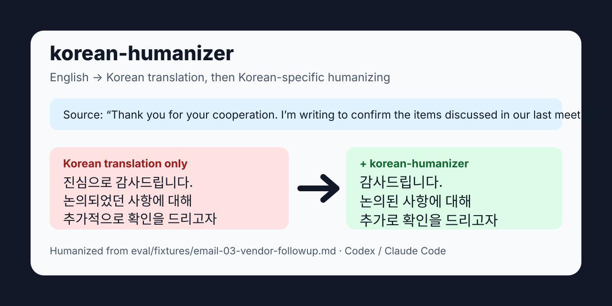

# korean-humanizer

> 面向 Codex 和 Claude Code 的韩语 AI 文本 humanizer。
>
> 它会去掉韩语 AI 生成文本中的“AI 味”，但不改变事实、数字、专有名词、链接或原意。

[English](README.md) · [한국어](README.ko.md)

[](CHANGELOG.md)
[](docs/STABILITY-PROMISE.md)



## 30 秒试用

把 [`PROMPT.short.md`](PROMPT.short.md) 复制到你的 LLM 或 agent instructions 中，然后输入：

```text
Humanize this Korean text:

🚀 혁신적인 솔루션을 활용하여 다양한 비즈니스 가치를 극대화하고,
이러한 접근을 통해 사용자 경험을 한층 더 고도화할 수 있습니다. ✨
```

输出示例：

```text
이 솔루션으로 여러 비즈니스 가치를 더 크게 만들고, 사용자 경험도 한 단계 개선할 수 있어요.
```

## 为什么需要韩语专用 humanizer

英语 AI 文本的特征不能直接套用到韩语。韩语有自己的 AI 写作痕迹：

- 翻译腔：`~에 있어서`, `~을 통해`, `~에 의해`
- 过度正式：`~인 것이다`, `~라고 할 수 있습니다`
- 指示词过多：`이러한`, `해당`
- 韩语 LLM 高频词：`활용`, `극대화`, `시사한다`, `도모`, `모색`
- 敬语和句尾语气不一致
- 口语脚本被改成书面 `~다` 风格

`korean-humanizer` 不是英文规则的翻译版，而是围绕韩语本身的写作信号设计的。

## 主要用途

### Codex

```bash
git clone https://github.com/dotoricode/korean-humanizer.git
cd korean-humanizer
bash scripts/install-codex-skill.sh
```

### Claude Code

```bash
mkdir -p ~/.claude/skills
git clone https://github.com/dotoricode/korean-humanizer.git ~/.claude/skills/korean-humanizer
```

然后直接请求：

```text
이거 AI 티 빼줘:
[韩语文本]
```

## 包含内容

- [`SKILL.md`](SKILL.md): skill 入口
- [`PROMPT.md`](PROMPT.md): 完整 system prompt
- [`PROMPT.short.md`](PROMPT.short.md): 快速试用版 prompt
- [`CHEATSHEET.md`](CHEATSHEET.md): 30 个常见韩语 AI 写作痕迹
- [`references/ko-ai-signals.md`](references/ko-ai-signals.md): 12 类 / 100+ 韩语模式目录
- [`eval/scorecard.md`](eval/scorecard.md): 自动评估结果

## 核心规则

- 保留事实、数字、专有名词、引用、链接。
- 不做摘要；除非用户明确要求缩短，否则输出长度不低于原文的 90%。
- 不整句、整段删除；优先弱化或替换 AI 痕迹。
- 不重写全文，只修改高置信度 AI 痕迹。
- 最多修改 20% 的句子，每段最多 3 处。
- 保留韩语语气和敬语等级。
- YouTube / 播客 / 讲稿等口语文本不能改成书面 `~다` 体。

## Services using korean-humanizer

由 Socialistic/Tinkerland 运营的第三方 community demo。这不是本仓库的官方服务。
由于这个 demo 在本仓库之外运行，用户输入的内容会由 Socialistic/Tinkerland 处理。

[![Try writing-dotoricode-korean-humanizer-5d759b on Socialistic][socialistic-demo-badge]][socialistic-demo-link]

## 许可证

MIT。

[socialistic-demo-badge]: https://socialistic.ai/api/embed/writing-dotoricode-korean-humanizer-5d759b
[socialistic-demo-link]: https://socialistic.ai/zh/skill/writing-dotoricode-korean-humanizer-5d759b?utm_source=github&utm_medium=readme&utm_campaign=20260520-writing-koc-creators&utm_content=badge
