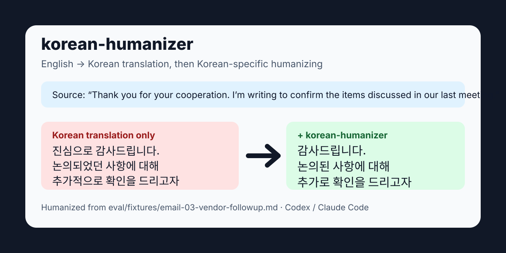

# korean-humanizer

> 面向 Codex 和 Claude Code 的韩语 AI 文本 humanizer。
>
> 它会去掉韩语 AI 生成文本中的“AI 味”，但不改变事实、数字、专有名词、链接或原意。

[English](README.md) · [한국어](README.ko.md)


最新正式版本是 **v1.0.1**。本文说明 main 的改进内容，下一版本号尚未确定。请参阅[版本政策](docs/STABILITY-PROMISE.md)和[变更说明](docs/UPGRADE-NOTES.md)。



## Warp 演示

2026-10-07 在 Warp 中实际运行 Codex CLI，工作目录为 `korean-humanizer`。请求、标题和说明使用英语，原文和修改后的邮件使用韩语。生成的响应未经后期改写。

[30 秒视频](https://github.com/dotoricode/korean-humanizer/blob/dotoricode/docs-warp-demo-media/assets/warp-demo/korean-humanizer-warp-demo-30s.mp4) · [请求截图](https://github.com/dotoricode/korean-humanizer/blob/dotoricode/docs-warp-demo-media/assets/warp-demo/01-request.png) · [完整结果截图](https://github.com/dotoricode/korean-humanizer/blob/dotoricode/docs-warp-demo-media/assets/warp-demo/02-result.png)

录制使用本地开发快照，与正式版本及公开 main 不同。视频保持原始播放速度；参阅[录制信息和文件哈希](https://github.com/dotoricode/korean-humanizer/blob/dotoricode/docs-warp-demo-media/assets/warp-demo/provenance.json)。

[原始交互录屏（MOV，45 秒）](https://github.com/dotoricode/korean-humanizer/blob/dotoricode/docs-warp-demo-media/assets/warp-demo/warp-demo-final-original.mov)。这是与上述 30 秒视频分开录制的文件，上传前未进行转换。

## 30 秒试用

把 [`PROMPT.short.md`](PROMPT.short.md) 复制到你的 LLM 或 agent instructions 中，然后输入：

```text
Humanize this Korean text:

🚀 혁신적인 솔루션을 활용하여 다양한 비즈니스 가치를 극대화하고,
이러한 접근을 통해 사용자 경험을 한층 더 고도화할 수 있습니다. ✨
```

实际调用 `$korean-humanizer` 的 Codex CLI + GPT-6 Astra 输出（2026-10-01，仅摘录正文，未在输出后重新编辑）：

```text
이 솔루션으로 여러 비즈니스 가치를 최대한 높이고, 사용자 경험도 더 개선할 수 있습니다.
```

[完整响应与运行条件](eval/native-skill-2026-10-01.md)

## 为什么需要韩语专用 humanizer

英语 AI 文本的特征不能直接套用到韩语。韩语有自己的 AI 写作痕迹：

- 翻译腔：`~에 있어서`, `~을 통해`, `~에 의해`
- 过度正式：`~인 것이다`, `~라고 할 수 있습니다`
- 指示词过多：`이러한`, `해당`
- 需要结合语境判断的词语：`활용`, `극대화`, `시사한다`, `도모`, `모색`
- 敬语和句尾语气不一致
- 口语脚本被改成书面 `~다` 风格

`korean-humanizer` 不是英文规则的翻译版，而是围绕韩语本身的写作信号设计的。

## 安装

在需要使用此技能的项目中运行以下命令。它使用 [Skills CLI](https://github.com/vercel-labs/skills)，需要 Node.js/npm。

```bash
npx skills add dotoricode/korean-humanizer --skill korean-humanizer --agent codex claude-code --copy
```

该命令把公开仓库的默认分支复制到 Codex 的 `.agents/skills/korean-humanizer/` 和 Claude Code 的 `.claude/skills/korean-humanizer/`。只安装一个环境时使用 `--agent codex` 或 `--agent claude-code`；添加 `--global` 可供所有项目使用。这是第三方技能安装 CLI，不是 Codex 或 Claude 的内置命令。

在该项目中开始新对话：Codex 使用 `$korean-humanizer`，Claude Code 使用 `/korean-humanizer`。通过 `npx skills list` 查看已安装技能。

PR #5 已合并。默认分支包含 v1.0.1 之后的改进，最新正式标签仍为 v1.0.1。安装和首次调用检查与输出质量评估分开；剩余发布检查记录在 `ROADMAP.md`。

然后直接请求：

```text
이거 AI 티 빼줘:
[韩语文本]
```

## 包含内容

- [`SKILL.md`](SKILL.md): skill 入口
- [`PROMPT.md`](PROMPT.md): 完整 system prompt
- [`PROMPT.short.md`](PROMPT.short.md): 快速试用版 prompt
- [`CHEATSHEET.md`](CHEATSHEET.md): 30 个常见韩语 AI 写作痕迹
- [`references/ko-ai-signals.md`](references/ko-ai-signals.md): 12 类 / 100+ 韩语模式目录
- [`eval/scorecard.md`](eval/scorecard.md): 固定输入与输出的回归检查结果，不是模型质量成功率

## 核心规则

- 保留事实、数字、专有名词、引用、链接。
- 保留核心信息、条件和确定程度；可删去重复和装饰表达，不设固定长度比例。
- 必要时可重新组织句子，保持信息和逻辑关系。
- 不重写全文，只修改高置信度 AI 痕迹。
- 不限制修改句数或比例，改善全文中生硬的表达。
- 保留韩语语气和敬语等级。
- YouTube / 播客 / 讲稿等口语文本不能改成书面 `~다` 体。

默认使用与 main 相同的 `Humanized` 和 `주요 변경 (최대 5개)` 两部分，并在首次回复附上修改提示。仅需正文时请明确说明。用 `personal=文件路径` 指定个人配置；示例列表不会自动生效。已自然的表达保持不变。

[文档索引](docs/README.md) · [手工示例](examples/before-after.md) · [评估方法与局限](eval/README.md)

## Services using korean-humanizer

由 Socialistic/Tinkerland 运营的第三方 community demo。这不是本仓库的官方服务。
由于这个 demo 在本仓库之外运行，用户输入的内容会由 Socialistic/Tinkerland 处理。

[![Try writing-dotoricode-korean-humanizer-5d759b on Socialistic][socialistic-demo-badge]][socialistic-demo-link]

## 许可证

MIT。

[socialistic-demo-badge]: https://socialistic.ai/api/embed/writing-dotoricode-korean-humanizer-5d759b
[socialistic-demo-link]: https://socialistic.ai/zh/skill/writing-dotoricode-korean-humanizer-5d759b?utm_source=github&utm_medium=readme&utm_campaign=20260520-writing-koc-creators&utm_content=badge
