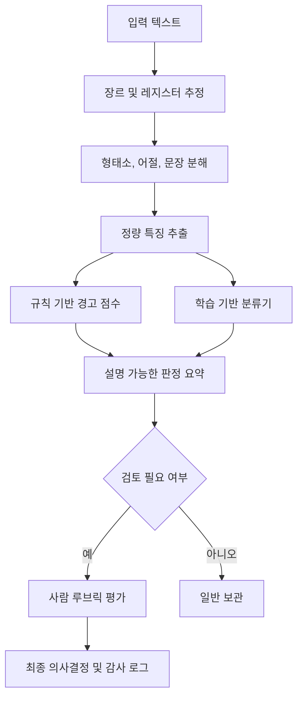

# 한국어 AI 작성 징후와 Humanizer 설계 문서 *(humanized)*

> `korean-humanizer` 의 **연구 근거 / 평가 프로토콜 / 윤리 한계** 위키.
>
> 이 파일은 [`korean-humanizer-research.md`](korean-humanizer-research.md) (raw) 를 같은 레포의 humanizer skill 로 다듬은 결과다. 같은 내용을 두 번 노출하는 이유는 **이 위키 자체가 좋은 시연 사례**이기 때문이다 — "AI 티가 어떻게 보이는지 설명하는 문서"가 그 자체로 AI 티를 가지고 있었다.
>
> 단락별 변경 이유와 정량/정성 분석은 [`examples/wiki-humanized-comparison.md`](examples/wiki-humanized-comparison.md) 에 정리되어 있다. 표 / 코드 블록 / Mermaid / References 는 사실 정보라 손대지 않았다.
>
> 12 카테고리 카탈로그( [`references/ko-ai-signals.md`](references/ko-ai-signals.md) )가 "어떤 패턴인가"를 다룬다면, 이 문서는 "왜 이 패턴이 한국어 AI 티인가, 어떻게 측정/평가하는가, 어디까지 써도 되는가"를 다룬다.

## Executive Summary

영어권에는 위키미디어 커뮤니티가 만든 `Signs of AI writing` 같은 집단 지식형 체크리스트가 있지만, 한국어권에서는 같은 지식이 국립국어원 규범 자료, 한국어 말뭉치, 최근의 ACL·EACL·국내 연구 성과에 흩어져 있다. 최근 연구는 한국어 AI 생성 텍스트 탐지에 영어 중심 방법을 그대로 가져다 쓰면 잘 안 된다고 본다. 한국어는 띄어쓰기 허용 범위가 넓고, 형태소 체계가 풍부하고, 쉼표 사용 관행과 상대 높임 체계가 영어와 다르다. KatFish 는 이 점을 살려 한국어 전용 특징을 설계했고, XDAC 은 짧고 비격식적인 뉴스 댓글에서 토큰·문자 수준 패턴을 끌어내 높은 탐지 성능을 보고했다.

이 문서는 흩어진 근거를 하나의 GitHub 용 한국어 레퍼런스로 모은 것이다. 핵심은 넷이다. 첫째, 한국어판 "AI 작성 징후" 는 표현 목록이 아니라 **장르·레지스터·담화 상황을 조건으로 한 다중 신호 체계**다. 둘째, 강한 신호 축은 **쉼표 사용 패턴**, **종결어미 및 높임법 분포**, **명사 편중과 술어·어미 부족**, **낮은 어휘 다양성**, **비격식 표지의 결핍**, **정형화된 연결어와 포맷**이다. 셋째, Humanizer 는 "탐지 회피" 가 아니라 **사실 보존 하의 한국어 자연화 편집기**로 설계해야 한다. 문장 종결 다양화, 연결어 절제, 명사구를 서술형으로 환원, 쉼표 감축, 맥락 허용 범위 안에서의 생략, 비격식 표지 조절 — 장르별로 다르게 쓴다. 넷째, 평가는 정확도뿐 아니라 **오탐률, 장르 일반화, 사람 판정 일치도, 사실 보존, 윤리 통제**를 함께 본다. 최근 한국어 연구는 사람도 보조 도구 없이는 AI 여부를 잘 못 가려내고, 판단 근거를 구조화해야 일관성이 올라간다고 본다.

이 문서는 공개 말뭉치 접근과 연산 자원이 지정되지 않은 상태를 전제로 쓴다. 그래서 실제 실험이 가능한 공개형 경로와 사내 코퍼스가 있는 조직형 경로를 같이 적어둔다. 수치가 논문에서 직접 보고된 경우와, 제안 설계 / 합성 예시인 경우는 분명히 구분한다.

## 배경과 문제 설정

### 왜 한국어 전용 기준이 필요한가

영어권 AI 작성 징후는 보통 긴 안전 문구, 전환어 과다, 템플릿형 문장, 제목 대문자화, 이모지·대시 같은 표면 신호로 정리된다. 한국어로 그대로 옮기기는 어렵다. 한국어는 종결어미가 화자 태도와 상대 높임을 직접 드러내고, 띄어쓰기에 허용 변이가 있고, 쉼표 사용 밀도도 영어와 다르다. KatFish 는 한국어의 **유연한 띄어쓰기**, **형태소 기반 구조**, **영어보다 적은 쉼표 사용**을 핵심 차이로 짚었다. 국립국어원 자료도 상대 높임을 여섯 등급으로 설명하면서, 해체·해요체 구별과 종결어미 분포가 문체 판단에 중요하다고 본다. 맞춤법 규정도 단음절 연쇄와 보조 용언에서 붙여쓰기를 허용하는 구간을 분명히 둔다. 한국어에서 "정답 하나" 만을 기대하는 규칙은 실제 쓰기 관행을 잘못 읽기 쉽다.

이게 왜 중요한가. 한국어 Humanizer 를 영어식 "AI 티 제거" 도구로만 만들면 두 갈래로 망한다. **번역투·보고서투가 더 단단해지거나**, **규범에서 벗어난 구어체가 마구 주입되는** 쪽이다. 한국어판 가이드는 영어권 휴리스틱을 참고하되, 실전에서는 한국어 고유 변수 — 종결어미, 높임법, 띄어쓰기 허용 변이, 어절/형태소 다양성, 감탄·반복 표지, 댓글/대화 특수기호 — 를 먼저 본다.

### 목적과 독자

이 문서의 목적은 셋이다. 첫째, **한국어 AI 작성 징후를 연구 가능한 특징 집합으로 정리**한다. 둘째, **AI 출력의 한국어 자연화 규칙을 엔지니어링 문서 수준으로 구체화**한다. 셋째, **GitHub 저장소에서 재현 가능한 실험·CI·프롬프트 자산 구성**까지 묶어 오픈소스 협업 문서로 바로 쓸 수 있게 한다. 대상 독자는 한국어 NLP 연구자, ML 엔지니어, 기술 문서 작성자, 제품 팀, 저장소 유지관리자. 최근 한국어 벤치마크가 단순 번역 과제를 넘어 한국 문화·언어 특수성을 직접 평가해야 한다고 강조하는 흐름과 같은 결이다.

### 기본 가정

이 문서는 다음을 기본 가정으로 둔다.

| 항목 | 상태 | 대응 방안 |
|---|---|---|
| 공개 말뭉치 접근 | 불명 | 국립국어원 모두의 말뭉치, AI말평, KatFish, XDAC, StyleKQC 중심의 공개형 계획 제시 |
| 사내 코퍼스 접근 | 불명 | 내부 댓글·문서·대화 로그 기반의 비공개형 계획도 병행 제시 |
| GPU/대형 모델 자원 | 불명 | CPU 기반 특징 추출 + 로지스틱 회귀/트리 모델과, 자원이 있을 때의 한국어 LLM/하이브리드 검출 계획을 분리 제시 |
| 배포 환경 | GitHub 가정 | Mermaid, Markdown lint, GitHub Actions, Claude Code/프롬프트 자산 구조 제안 |

국립국어원은 신문 / 일상 대화 / 메신저·온라인 대화 등 여러 유형의 한국어 말뭉치를 꾸준히 공개한다. AI 말평은 한국어 모델 성능 평가 벤치마크로 굴러간다. "한국어판 canonical guide" 는 이론 요구가 아니라 만들 수 있는 엔지니어링 과제다.

## 선행연구와 참고 문헌 정리

### 영어권 탐지 연구의 큰 축

LLM 생성 텍스트 탐지 연구는 크게 다섯으로 나뉜다 — **통계/제로샷 계열**, **교란 기반 계열**, **지도학습 계열**, **워터마킹 계열**, **혼합·앙상블 계열**. 최근 서베이는 DetectGPT, NPR, Fast-DetectGPT, RoBERTa 계열 미세조정, 대조·내재차원 특징 기반 방법을 이 흐름 안에서 묶는다. DetectGPT 는 생성 텍스트가 확률 곡면의 음의 곡률 영역에 놓인다는 가정으로 확률 곡률을 본다. Binoculars 는 두 LLM 을 대비해 학습 없이도 높은 정확도를 낸다. MAGE 와 RAID 는 실제 환경에 가까워질수록 도메인 외 샘플, 새 생성기, 샘플링 전략, 공격적 재작성에 의해 탐지 난도가 급격히 올라간다고 본다.

"탐지 가능성" 을 냉정하게 보는 연구도 중요하다. Sadasivan 등은 재귀적 의역 공격이 텍스트 품질은 크게 해치지 않으면서 탐지율을 크게 떨어뜨릴 수 있음을 보였다. 표면 특징만으로는 실전 탐지를 지키기 어렵다는 뜻이다. Liang 등은 AI 탐지기가 비원어민 영어 글에 편향될 수 있고, 프롬프트만 살짝 바꿔도 일부 우회가 된다고 본다. "AI 작성 징후" 문서는 **확률적·설명형 보조 도구**다. 사람을 단정하는 기계 판정기가 아니다.

### 한국어 관련 탐지 연구

한국어 쪽은 최근에야 쌓이기 시작했다. KatFish 는 에세이 / 시 / 논문 초록 세 장르에서 인간 / LLM 텍스트를 모은 첫 한국어 탐지 벤치마크다. 한국어 언어 특징에 기반한 KatFishNet 은 기존 방법보다 평균 19.78 % 높은 AUC-ROC 를 냈다. XDAC 은 뉴스 댓글처럼 **짧고 비격식적인 텍스트**를 겨냥해 1.3 M 인간 댓글 + 1 M LLM 댓글 + 14 개 모델로 큰 벤치마크를 만들었다. 댓글 탐지 98.5 % F1, 생성 모델 귀속 84.3 % F1. Findings of EACL 한국어 전용 비지도 프레임워크는 F1 0.963 / ROC-AUC 0.985 로, 저자 주석 데이터 없이도 강한 성능이 가능함을 보였다.

사람의 한국어 AI 판별 능력에 대한 결과도 중요하다. 한 한국어 실험에서는 참가자 116 명이 인간 / ChatGPT / HyperClova X 에세이를 구분했다. 정답률은 거의 우연 수준이었고, ChatGPT 글이 품질 평가에서 최고점을 받았다. LREAD 는 직관만 쓸 때 흔들리던 사람 판단이 기준표와 근거 서술을 도입하자 정확도와 합의도가 크게 오른다고 본다. 두 결과는 "사람이 보면 다 안다" 도, "모델 점수 하나면 충분하다" 도 과장임을 보여 준다. 한국어판 가이드는 **기계 특징 + 사람 기준표 + 감사 가능한 설명**을 같이 쓴다.

### 한국어 스타일 전환과 평가 자원

Humanizer 설계에는 스타일 전환 연구가 바로 도움이 된다. StyleKQC 는 한국어 질문·명령문 스타일 변형 평행 말뭉치다. 한국어에서 공손성 접미사와 높임 표현이 대화 스타일 전환의 핵심임을 보여 준다. 문장 끝 하나만 바꾸는 게 아니라 **화행, 주제, 높임, 어휘 선택**이 같이 움직여야 자연스럽다는 근거다. CLIcK 와 HAE-RAE Bench 는 한국어 평가에서 단순 번역 벤치마크가 놓치는 문화·언어 뉘앙스를 짚는다. "한국어 Humanizer" 는 문장 매끈화가 아니라 **한국어 화용성의 복원**이어야 한다는 방향과 맞물린다.

공개 자원 쪽도 한국어는 이전보다 훨씬 실험 친화적이다. 국립국어원 모두의 말뭉치는 신문 / 일상 대화 / 온라인 대화 / 글쓰기 원시 자료 등 여러 장르를 준다. AI 말평은 365 일 상시 한국어 모델 성능 검증을 노린다. 저장소 단위에서 재현 가능한 데이터 파이프라인을 만들 기반이 있다.

## 한국어 AI 작성 징후와 탐지 특징

### 한국어에서 실제로 강한 신호

문헌을 종합하면, 한국어 AI 작성 징후는 크게 여섯 범주로 요약할 수 있다.

첫째, **쉼표 사용의 과잉과 위치 편향**이다. KatFish 는 한국어 LLM 텍스트가 인간 글보다 쉼표를 더 자주 쓰고, 더 뒤쪽에 두고, 쉼표 사이 구간도 더 길다고 본다. 쉼표 주변 품사 조합 다양성도 LLM 쪽이 더 높다. 영어권 글쓰기 관성이 한국어 문장에 이식되면서 생기는 번역투적 세분화와 결이 같다.

둘째, **띄어쓰기의 과도한 정렬**이다. KatFish 는 사람이 글의 맥락 / 편의 / 시적 허용 / 규칙 이해 차이 때문에 띄어쓰기를 줄이거나 바꾸는 반면, LLM 은 학습 데이터의 평균 규칙을 더 엄격히 따른다고 본다. 국립국어원 규정도 단음절 연쇄와 보조 용언에서 원칙/허용 복수 형태를 인정한다. 한국어 Humanizer 가 자연스러움을 만들려면 "무조건 더 규범적으로" 가 아니라 **허용 범위 안 변이**를 안다.

셋째, **품사·구조 다양성의 감소와 명사 편중**이다. KatFish 는 인간 글의 POS n-gram 다양성이 더 높고, LLM 은 더 흔한 구조를 반복한다고 본다. 부록 분석에선 LLM 이 명사를 더 많이 쓰고, 사람은 술어와 어미를 더 풍부하게 써서 문장 흐름이 더 역동적이라고 설명한다. 한국어 AI 글은 정보가 빠지진 않는데 **문장이 "살아 움직이는 느낌" 이 부족**해지기 쉽다.

넷째, **낮은 어휘 다양성과 반복되는 안전 표현**이다. KatFish 는 LLM 텍스트가 인간보다 낮은 lexical diversity 를 보인다고 정리한다. XDAC 은 짧은 뉴스 댓글에서 AI 가 형식적 구조와 표준화된 표현을 선호하고, 인간 댓글은 비격식·감정·특수문자 패턴이 더 다양하다고 본다. 장문에서는 "다양하다/효율적이다/중요하다/것 같다" 류 안전 평가 표현이, 단문에서는 "ㅋㅋ/ㅠㅠ/…/??!!" 같은 실사용 표지의 결핍이 신호다.

다섯째, **종결어미와 높임법의 단조로움**이다. 국립국어원은 상대 높임을 해라체 / 하게체 / 하오체 / 하십시오체 / 해체 / 해요체 6 등급으로 나누고, 해요체는 해체에 `요` 가 붙어 만들어진다고 설명한다. 한국어 사람 글은 장르와 관계에 따라 종결어미 분포가 바뀌고, 대화에서는 한 텍스트 안에서도 평평하지 않다. LLM 은 특정 기본 레지스터에 과정렬되기 쉽다. **문장말 엔트로피**와 **높임 혼합도** 가 한국어판 핵심 변수다.

여섯째, **짧은 비격식 텍스트에서의 인간 표지 결핍**이다. XDAC 은 LGC 가 형식적·표준화된 표현을 띠는 반면, 인간 댓글은 반복 문자 / 감정 기호 / 비격식 표현 / formatting variation 이 더 많다고 본다. 블로그 댓글, 커뮤니티 답글, 리뷰, 메신저 같은 장르에서 특히 중요하다. 장문 보고서에 `ㅋㅋ` 을 넣는 건 어색하지만, 댓글 장르에서 그런 표지가 아예 없으면 기계 냄새가 난다.

### 문헌에서 바로 가져올 수 있는 실제 분포

다음 표는 KatFish 가 보고한 **쉼표 사용 패턴**의 실제 수치다. "한국어 AI 글은 쉼표를 더 많이, 더 늦게, 더 길게 쓴다" 는 직관에 숫자를 붙여 준다.

| 장르 | 지표 | 인간 | LLM |
|---|---:|---:|---:|
| 에세이 | 쉼표 포함 문장 비율 | 26.31 | 61.03 |
| 에세이 | 쉼표 사용률 | 1.13 | 2.56 |
| 에세이 | 평균 상대 위치 | 0.09 | 0.18 |
| 에세이 | 평균 분절 길이 | 4.35 | 8.56 |
| 에세이 | 쉼표 주변 POS 다양성 | 24.38 | 59.39 |
| 시 | 쉼표 포함 문장 비율 | 27.01 | 42.90 |
| 시 | 쉼표 사용률 | 2.61 | 4.84 |
| 시 | 평균 상대 위치 | 0.14 | 0.28 |
| 시 | 평균 분절 길이 | 1.96 | 2.13 |
| 시 | 쉼표 주변 POS 다양성 | 23.13 | 23.86 |
| 논문 초록 | 쉼표 포함 문장 비율 | 47.48 | 65.21 |
| 논문 초록 | 쉼표 사용률 | 1.73 | 2.40 |
| 논문 초록 | 평균 상대 위치 | 0.20 | 0.25 |
| 논문 초록 | 평균 분절 길이 | 9.07 | 11.55 |
| 논문 초록 | 쉼표 주변 POS 다양성 | 42.85 | 61.95 |

```text
[실측 예시] 장르별 쉼표 포함 문장 비율 (%)

에세이      인간 26.31  █████
            LLM  61.03  ████████████

시          인간 27.01  █████
            LLM  42.90  █████████

논문 초록   인간 47.48  █████████
            LLM  65.21  █████████████
```

다음 표는 KatFish 가 보고한 **장르별 평균 AUC-ROC** 요약이다. "기존 최강 기준선" 은 장르별 최고 baseline 하나를 고른 값이고, 한국어 전용 punctuation 특징이 세 장르 모두에서 가장 강한 축으로 작동했음을 보여 준다.

| 장르 | 장르별 최고 baseline | 평균 AUC-ROC | KatFish punctuation | 평균 AUC-ROC |
|---|---|---:|---|---:|
| 에세이 | LLM paraphrasing | 81.27 | KatFish punctuation | 94.88 |
| 시 | DetectGPT | 66.02 | KatFish punctuation | 73.10 |
| 논문 초록 | LLM paraphrasing | 57.33 | KatFish punctuation | 75.62 |

```text
[실측 예시] 장르별 평균 AUC-ROC

에세이      최고 baseline   81.27  ████████████████
            punctuation     94.88  ███████████████████

시          최고 baseline   66.02  █████████████
            punctuation     73.10  ███████████████

논문 초록   최고 baseline   57.33  ███████████
            punctuation     75.62  ███████████████
```

### 한국어판 canonical feature set

아래 표가 이 문서가 제안하는 **한국어 AI 작성 징후 feature schema** 다. "의심 방향" 은 절대 규칙이 아니라 **같은 장르·길이·레지스터의 인간 기준선 대비 z-score** 로 읽는다.

| 특징 | 유형 | 측정 방식 | 한국어적 이유 | 의심 방향 | 비고 |
|---|---|---|---|---|---|
| 문장 길이 분산 | 정량 | 문장별 형태소 수 분산 | 한국어 인간 글은 길이 리듬이 흔들림 | 분산이 지나치게 낮음 | 장르 보정 필수 |
| 쉼표 포함 비율 | 정량 | 쉼표 포함 문장 / 전체 문장 | LLM의 쉼표 과사용 | 높을수록 의심 | 에세이·초록에서 특히 강함 |
| 쉼표 상대 위치 | 정량 | 쉼표 위치 / 문장 길이 평균 | 영어식 후행 쉼표 패턴 | 뒤로 갈수록 의심 | 장르별 기준 필요 |
| 쉼표 분절 길이 | 정량 | 쉼표로 분리된 세그먼트 길이 | LLM은 긴 분절을 쉼표로 이어 붙임 | 길수록 의심 | 초록에서 강함 |
| POS n-gram 다양성 | 정량 | 고유 POS n-gram / 전체 n-gram | 인간의 구조적 유연성 | 낮을수록 의심 | 장문에 유효 |
| 명사 비율 | 정량 | 명사 형태소 / 전체 형태소 | LLM의 정보전달 최적화 경향 | 높을수록 의심 | 술어/어미와 함께 봄 |
| 술어·어미 비율 | 정량 | 용언·어미 / 전체 형태소 | 인간은 서술과 리듬이 더 풍부 | 낮을수록 의심 | 대화/수필에서 강함 |
| 어휘 다양성 | 정량 | MATTR/MTLD/lemma TTR | LLM 반복 경향 | 낮을수록 의심 | 한국어는 형태소 기준 권장 |
| 종결어미 엔트로피 | 정량 | 문장말 어미 분포의 엔트로피 | 상대 높임·발화 태도 다양성 | 너무 낮으면 의심 | 장르/페르소나 보정 |
| 높임법 혼합도 | 정량 | 해체·해요체·하십시오체 분포 | 과도한 레지스터 정렬 탐지 | 지나치게 평평하면 의심 | 혼합 자체를 강제하면 안 됨 |
| 연결어 빈도 | 정량 | `또한/따라서/즉/한편/뿐만 아니라` 등 빈도 | 번역투·보고서투 패턴 | 높을수록 의심 | 논증문에서만 약하게 적용 |
| 비격식 표지 지수 | 정량 | `ㅋㅋ/ㅎㅎ/ㅠㅠ/?!/...` 간투사, 감탄사, 반복문자 | 댓글·채팅 인간성 표지 | 너무 낮으면 의심 | 댓글/대화에만 |
| 허용 띄어쓰기 변이율 | 정량 | 보조용언·단음절 연쇄의 허용 변형 비율 | 한국어 규범의 허용 변이 반영 | 지나치게 0이면 의심 | 규범 위반과 구별해야 함 |
| 포맷 정형성 | 정량/정성 | 리스트 길이 대칭, 소제목 반복, 안전 문구 | LLM 템플릿성 | 높을수록 의심 | README/문서 장르에 중요 |
| 감정/입장 흔들림 | 정성 | 확신·유보·감탄의 국소 변화 | 인간 글은 미세한 입장 변화 보임 | 전 구간 과도하게 평탄 | 사람 평가 루브릭과 결합 |

이 표의 핵심은 "표현 하나" 가 아니라 **분포와 조합**이다. `또한` 하나, `-습니다` 하나로 판정을 내리지 않는다. 한국어 사람 참가자도 보조 도구 없이는 AI / 인간 구분이 겨우 chance 를 조금 넘었고, 영어권 탐지기도 언어 다양성이 낮은 사람 글을 AI 로 오분류한다. 실제 판정은 독립 신호 3 개 이상이 같은 방향이면 **검토 필요**로만 올리는 보수적 정책이 맞다.

### 초기 경고선과 판정 규칙

실무에서는 절대 임계보다 **장르-조건부 z-score** 가 더 안전하다. 초기값은 다음처럼 둘 수 있다.

| 지표 | 초기 경고선 제안 | 해석 |
|---|---|---|
| 쉼표 포함 비율 | z ≥ +1.0 | 장르 평균보다 높음 |
| 쉼표 상대 위치 | z ≥ +0.8 | 쉼표가 문장 후반에 치우침 |
| POS n-gram 다양성 | z ≤ -0.8 | 구조적 반복이 큼 |
| 어휘 다양성 | z ≤ -1.0 | 어휘 반복이 큼 |
| 명사 비율 | z ≥ +0.8 | 명사 편중 |
| 술어·어미 비율 | z ≤ -0.8 | 서술성 약화 |
| 종결어미 엔트로피 | z ≤ -0.7 | 문장말이 과도하게 단조로움 |
| 연결어 빈도 | z ≥ +1.0 | 안전한 전환어 과사용 |
| 비격식 표지 지수 | z ≤ -1.0 | 댓글/채팅에 비해 지나치게 매끈함 |

판정 규칙은 다음과 같다.

1. **장르 추정**: 댓글 / 대화 / 에세이 / 초록 / 문서형을 먼저 추정한다.
2. **장르 기준선 정렬**: 각 지표를 장르 기준 인간 코퍼스에 대해 정규화한다.
3. **다중 신호 합산**: 한 신호로 판정하지 않는다. 상관이 낮은 신호 3 개 이상이 모일 때만 검토 대상으로 올린다.
4. **설명 가능한 요약**: "쉼표 후행성 + 낮은 종결 다양성 + 높은 명사 비율" 처럼 사람이 읽을 수 있는 이유를 같이 낸다.
5. **사람 루브릭 검토**: 최종 판정은 자동 결정이 아니라 루브릭 기반 검토로 넘긴다.



### 사람 평가용 한국어 루브릭

LREAD 가 보여 주듯, 한국어 AI 판정은 "느낌" 보다 **근거 문장화** 가 중요하다. 5 점 척도 루브릭을 권한다.

| 축 | 질문 | 1점 | 5점 |
|---|---|---|---|
| 문장 흐름 | 종결과 연결이 살아 있는가 | 기계적 단조로움 | 자연스러운 리듬 |
| 레지스터 | 높임/반말/문어체가 맥락에 맞는가 | 과정렬/혼재 | 맥락 일치 |
| 구체성 | 실제 사람이 쓸 법한 국소성 있는가 | 추상적 일반론 | 맥락적 구체성 |
| 감정/입장 | 태도와 정서의 미세 변화가 있는가 | 평평함 | 살아 있는 변화 |
| 비격식 표지 | 장르에 맞는 기호/간투사/생략이 있는가 | 과도한 매끈함 | 장르 적합 |

## Humanizer 설계와 변환 규칙

### 설계 원칙

이 문서에서 말하는 Humanizer 는 "검출 회피기" 가 아니다. 정의는 다음과 같다.

> **Humanizer = 사실을 바꾸지 않으면서, 장르와 화자 맥락에 맞게 한국어의 변이·리듬·화용성을 복원하는 편집 계층**

설계 근거는 둘이다. 하나는 탐지 연구가 보여 준 **AI 텍스트의 한국어적 편향**, 다른 하나는 StyleKQC 가 보여 준 **한국어 스타일 전환이 공손성·화행·형태소 표현이 같이 움직여야 자연스럽다는 점**. Anthropic 권고도 출력 포맷을 분명히 지정하고, 예시를 주고, 복잡한 작업은 서브태스크로 쪼개라고 한다. Humanizer 도 프롬프트 하나에 다 맡기기보다 **규칙 기반 전처리 + 모델 기반 재작성 + 사실 보존 검사** 3 단 구조가 낫다.

### 결정적 변환 규칙

아래 규칙은 장르별로 조건부 적용한다.

#### 종결어미 다양화

- 에세이/칼럼: `-다` 일변도면 일부를 `-이다`, `-라고 볼 수 있다`, `-하는 편이다`, `-했다고 본다`처럼 변주.
- 대화/블로그: 해요체 내부에서도 `-어요/-네요/-죠/-거든요/-더라고요` 분산.
- 댓글/채팅: 화자 페르소나가 허용할 때만 해체, 생략, 반응 구문 추가.
- 공식 문서: 하십시오체 유지. 단, 모든 문장을 `-습니다`로 끝내지 말고 명사형 제목, 짧은 설명문, 불릿을 혼합.

근거: 한국어 상대 높임 등급, 해체 / 해요체 전환 가능성.

#### 쉼표 감축과 문장 분할

- 쉼표를 정보 구조상 필수인 경우에만 유지.
- 후행 쉼표가 길게 이어지면 둘로 나눌 수 있으면 분리.
- “A, B, C이다” 대신 “A이고 B다. C도 해당한다.” 같은 분산 서술 허용.
- 초록/설명문에서는 쉼표보다 **짧은 문장 2개**가 더 한국어답게 들리는 경우가 많다.

근거: KatFish 의 강한 실측 결과 (위 부록 표).

#### 명사구를 서술형으로 환원

- `효율성 향상 가능성` → `효율이 높아질 수 있다`
- `문제 해결의 필요성` → `문제를 풀 필요가 있다`
- `형식적 구조와 표준화된 표현의 사용` → `형식적으로 쓰고 표현도 표준화하는 경향이 있다`

KatFish 부록은 LLM 이 명사 편중을 보이고, 사람은 술어 / 어미를 더 풍부하게 쓴다고 정리한다. Humanizer 는 이 편향을 정반대로 푼다.

#### 연결어 절제

- `또한/따라서/즉/한편/뿐만 아니라`를 유지하지 않아도 의미가 보이면 삭제.
- 접속 표현을 반복하지 말고, 인접 문장의 논리 관계를 서술 리듬으로 흡수.
- 필요 시 연결어를 **격식 서면용**과 **구어형**으로 분기: `따라서` ↔ `그래서`, `즉` ↔ `쉽게 말해`.

#### 허용 범위 내 생략과 구어성 회복

- 대화/댓글에서는 주어 반복 삭제.
- 반응문에서 `그런데`, `아니`, `솔직히`, `사실`, `음`, `뭐` 같은 담화 표지 삽입 가능.
- 다만 공식 문서·논문 요약에서는 생략을 최소화하고 명시성을 유지.

#### 장르 적합한 비격식 표지 조절

- 뉴스 댓글/커뮤니티: 필요할 경우 `ㅋㅋ`, `ㅠㅠ`, `...`, `?!`, 반복 자모를 낮은 확률로 허용.
- 블로그 후기: `좀`, `은근`, `괜히`, `생각보다` 같은 완충 부사와 주관화 표지 허용.
- README/기술 문서: 이 단계는 비활성화.

근거: XDAC 이 보여 준 인간 댓글의 비격식·감정·특수문자 다양성.

#### 허용 띄어쓰기 변이 활용

- 보조 용언과 단음절 연쇄에서 국립국어원 규범이 허용하는 범위만 활용.
- 예: `먹어 보다` ↔ `먹어보다`, `좀 더` ↔ `좀더` 같은 허용 변형은 가능하지만, 규범 위반은 금지.
- Humanizer는 **오탈자 생성기**가 아니다.

한국어 규범이 실제로 허용하는 변이를 좁은 범위에서만 쓰는 게 핵심이다.

### 확률적 변환 레이어

규칙만 쓰면 무작위성이 인공적으로 보일 수 있다. 다음과 같은 확률 샘플링을 얹는다.

| 레이어 | 샘플링 단위 | 예시 |
|---|---|---|
| 종결 변형 | 문장 | `-습니다` 0.6, `-합니다` 0.2, 명사형 불릿 0.2 |
| 연결어 삭제 | 절 | 명시 연결어를 30% 확률로 삭제 |
| 쉼표 삭제/분할 | 문장 | 쉼표 문장 중 40%를 분리 시도 |
| 담화 표지 삽입 | 문단 시작 | 후기/대화 장르에서만 10~20% |
| 생략 | 인접 문장 쌍 | 동일 주어 반복 시 25% 생략 시도 |
| 구체화 | 예시 슬롯 | 소스에 근거한 경우만 채움, 무근거면 금지 |

이 레이어는 **장르 prior** 와 **페르소나 prior** 를 가진다. 기술 README 는 쉼표 감축과 연결어 절제만 쓰고, 비격식 표지는 0 으로 둔다. 커뮤니티 댓글은 종결 다양화 / 담화 표지 / 특수문자 조절까지 열어 둔다.

### 안전 장치와 금지 규칙

Humanizer 가 쓸만한 편집기가 되려면 다음 금지 규칙이 필요하다.

1. **사실 보존**: 숫자, 날짜, 고유명사, 부정 표현, 인용 관계를 바꾸지 않는다.
2. **출처 보존**: 인용문과 참고 근거의 위치를 그대로 둔다.
3. **추가 구체화 금지**: 원문에 없는 사례·경험·감정·평가를 새로 만들지 않는다.
4. **신뢰도 저하 방지**: 법률 / 의료 / 보안 / 재무 텍스트는 비격식 변환과 생략을 원칙적으로 금지.
5. **감사 가능성**: 변환 전후 diff 와 rule log 를 남긴다.
6. **목적 제한**: 사칭 / 표절 위장 / 평가 우회 목적 사용을 금지.

근거: 탐지기가 공격적 재작성에 약하고 편향·오탐 위험이 있다는 선행연구와 결을 맞춘 것.

### Humanizer 의사코드

```python
def apply_humanizer(text, genre, persona, constraints):
    """
    constraints:
      - preserve_facts: bool
      - preserve_citations: bool
      - allowed_registers: set[str]
      - risk_level: {"low","medium","high"}
    """

    doc = analyze_korean(text)  # sentence split, morphemes, endings, spacing, punctuation

    # 1. Detect risky traits
    features = extract_features(doc)
    alerts = score_against_genre_baseline(features, genre)

    # 2. Build edit plan
    plan = []
    if alerts["comma_overuse"] > 0:
        plan.append("reduce_commas")
    if alerts["nominal_heavy"] > 0:
        plan.append("predicate_restore")
    if alerts["ending_entropy_low"] > 0:
        plan.append("diversify_endings")
    if genre in {"comment", "chat"} and alerts["colloquiality_low"] > 0:
        plan.append("restore_colloquial_markers")
    if alerts["connective_overuse"] > 0:
        plan.append("trim_connectives")
    if genre in {"essay", "blog", "comment"} and alerts["safe_expression_repeat"] > 0:
        plan.append("lexical_diversify")

    # 3. Apply deterministic safe rewrites
    rewritten = text
    for step in plan:
        rewritten = run_rule(rewritten, step, genre=genre, persona=persona)

    # 4. Optional probabilistic variations
    rewritten = sample_register_variants(
        rewritten,
        genre=genre,
        persona=persona,
        allowed_registers=constraints["allowed_registers"],
    )

    # 5. Guardrails
    if constraints["preserve_facts"]:
        assert facts_equivalent(text, rewritten)
    if constraints["preserve_citations"]:
        assert citations_preserved(text, rewritten)
    if constraints["risk_level"] == "high":
        rewritten = disable_colloquial_layers(rewritten)

    # 6. Re-score and produce audit output
    new_features = extract_features(analyze_korean(rewritten))
    report = {
        "before": features,
        "after": new_features,
        "applied_rules": plan,
        "fact_preserved": True,
    }
    return rewritten, report
```

### Kotlin 예시

```kotlin
data class EndingProfile(
    val declarative: Double,
    val hedged: Double,
    val colloquial: Double
)

fun diversifySentenceEnding(sentence: String, profile: EndingProfile, genre: String): String {
    if (genre == "README" || genre == "paper_abstract") return sentence

    return when {
        sentence.endsWith("습니다.") && profile.hedged > 0.35 ->
            sentence.removeSuffix("습니다.") + "는 편입니다."
        sentence.endsWith("이다.") && profile.colloquial > 0.25 ->
            sentence.removeSuffix("이다.") + "인 느낌이다."
        sentence.endsWith("다.") && profile.declarative < 0.50 ->
            sentence.removeSuffix("다.") + "라고 볼 수 있다."
        else -> sentence
    }
}
```

### Java 예시

```java
public interface HumanizerRule {
    String name();
    boolean supports(String genre);
    String apply(String input);
}

public final class PreserveFactsConstraint {
    public static void validate(String before, String after) {
        // Very small example: in production compare entities, numbers, negations, dates.
        if (!before.replaceAll("[^0-9]", "").equals(after.replaceAll("[^0-9]", ""))) {
            throw new IllegalStateException("Numeric facts changed");
        }
    }
}
```

## 평가 방법론과 실험 설계

### 권장 데이터셋 구성

공개형 계획에서는 다음 구성이 현실적이다.

| 용도 | 공개 데이터 제안 | 근거 |
|---|---|---|
| 인간 문어 코퍼스 | 국립국어원 신문 말뭉치 2024, 글쓰기 원시 자료 2023/2024 | 신문·글쓰기 원시 자료 제공  |
| 인간 대화 코퍼스 | 일상 대화 말뭉치 2023/2024, 온라인 대화 말뭉치 2021 | 일상/온라인 대화 제공  |
| 스타일 전환 | StyleKQC | 한국어 formality transfer 자원  |
| 한국어 평가 보조 | KLUE, CLIcK, HAE-RAE, AI말평 과제 | 한국어 성능/문화/지식 평가  |
| AI 생성 코퍼스 | KatFish, XDAC | 한국어 AI 탐지 벤치마크  |

비공개형 계획에서는 **사내 댓글, 지원 채팅, 내부 문서, 리뷰 텍스트**를 추가한다. XDAC 처럼 익명화와 공개 접근 가능한 수집 경로 원칙을 따른다. 개인정보와 삭제 요청 이력은 반드시 분리한다.

### 전처리와 샘플링 원칙

공개형 / 비공개형 모두 최소한 다음 전처리가 필요하다.

- 중복 제거: near-duplicate 문장 / 번역 재생성 문장 제거
- 장르 균형: 댓글 / 대화 / 설명문 / 논증문 분리
- 길이 버킷: 짧은 글과 긴 글을 섞지 않음
- PII 마스킹: 이름 / 전화번호 / 메일 / 사번 제거
- 레지스터 어노테이션: 해체 / 해요체 / 하십시오체 / 혼합
- 인간-기계 페어링: 같은 프롬프트 / 주제 / 장르를 맞춰 비교

KatFish 와 최근 비지도 한국어 탐지 연구 모두 장르 / 도메인 구분이 성능과 해석을 바꾼다고 본다. 댓글 쪽은 XDAC 처럼 짧고 비격식적인 텍스트에 맞는 별도 모델이 낫다.

### 실험 프로토콜

권장 실험은 네 층으로 나눈다.

#### 특징 기반 베이스라인

- 입력: 형태소 기반 정량 특징 벡터
- 모델: Logistic Regression, Random Forest, XGBoost
- 장점: 설명 가능, CPU 가능, 특징 중요도 해석 쉬움
- 권장 용도: canonical guide의 1차 구현

#### 제로샷·비지도 비교

- DetectGPT류, Binoculars류, TOCSIN+SimLLM류
- 장점: 라벨이 적어도 비교 가능
- 주의: 한국어 특화 조정이 없으면 일반화 불안정

#### 장르 특화 지도학습

- 문어/댓글/대화를 분리해 학습
- 댓글 영역은 XDAC류 문자·형식 신호 추가
- 문어 영역은 KatFish류 쉼표·형태소 신호 강화

#### 사람 평가

- 3인 이상 한국어 전공 또는 숙련 편집자
- 루브릭 기반 블라인드 평가
- ABX 또는 pairwise preference + 근거 서술
- Cohen/Fleiss κ와 majority vote 정확도 측정

사람은 루브릭 없이는 흔들리고, 자동 탐지기는 공격·도메인 이동에 약하다는 연구 결과를 같이 반영한 설계다.

### 지표

탐지 모델은 다음 지표를 같이 본다.

| 범주 | 지표 |
|---|---|
| 분류 성능 | Precision, Recall, F1, ROC-AUC, PR-AUC |
| 운영 안정성 | FPR@target recall, ECE, 장르별 편차 |
| 일반화 | unseen model, unseen domain, paraphrase robustness |
| 설명성 | feature attribution, 사람이 이해 가능한 사유문 |
| 사람 평가 | 정확도, κ, pairwise preference |
| Humanizer | 사실 보존율, 사람 선호도, detector confidence 변화, 변환 로그 일관성 |

### 권장 표본 수

다음은 **제안치**다.

| 실험 | 최소 제안 |
|---|---:|
| 장르별 인간/AI 문서 | 각 500~1,000개 |
| 댓글/채팅 짧은 샘플 | 각 5,000개 이상 |
| 사람 평가 | 조건별 100쌍, 평가자 3~5인 |
| Humanizer A/B 테스트 | 장르별 50~100문서 |
| 임계값 보정 세트 | 인간 전용 300문서 이상 |

### 문헌 기반 결과 요약

| 연구 | 설정 | 핵심 수치 | 해석 |
|---|---|---:|---|
| KatFish | 한국어 문어 3장르 탐지 | 평균 +19.78% AUC-ROC 개선 | 한국어 전용 특징의 가치  |
| KatFish punctuation | 에세이/시/초록 | 94.88 / 73.10 / 75.62 AUC | 쉼표 특징이 강력  |
| XDAC | 한국어 뉴스 댓글 탐지/귀속 | 98.5 F1 / 84.3 F1 | 짧은 비격식 텍스트는 별도 신호가 필요  |
| 비지도 한국어 탐지 | 뉴스/초록/에세이 | 0.963 F1 / 0.985 ROC-AUC | 라벨 없이도 가능  |
| 한국어 인간 vs AI 에세이 | 116명 참가자 | 정답률 54.8~60.6% | 사람도 쉽게 구분 못함  |
| LREAD | 루브릭 기반 사람 판정 | 0.60→0.90, κ -0.09→0.82 | 기준표가 필수  |

### 예상 합성 결과 예시

아래 표는 **실험을 실제로 돌리지 못한 상태에서 보여 주는 합성 예시**다. 방향만 참고하고, 인용 대상으로 쓰지 않는다.

| 조건 | Detector score | 사실 보존 | 사람 선호도 | 비고 |
|---|---:|---:|---:|---|
| 원문 AI 출력 | 0.78 | 1.00 | 3.1/5 | 쉼표/연결어/명사 편중 |
| 규칙형 Humanizer 후 | 0.61 | 0.99 | 3.8/5 | 쉼표 감소, 종결 변주 |
| 규칙+모델 Humanizer 후 | 0.54 | 0.97 | 4.2/5 | 더 자연스러우나 오편집 위험 증가 |
| 규칙+모델+사실검사 후 | 0.56 | 0.99 | 4.1/5 | 운영 권장안 |

### 재현용 Python 스크립트 골격

```python
import json
import math
from collections import Counter
from pathlib import Path

from kiwipiepy import Kiwi
from sklearn.feature_extraction import DictVectorizer
from sklearn.linear_model import LogisticRegression
from sklearn.metrics import roc_auc_score, f1_score
from sklearn.model_selection import train_test_split

kiwi = Kiwi()

SAFE_CONNECTIVES = {"또한", "따라서", "즉", "한편", "뿐만", "그러나", "반면"}
COLLOQUIAL_MARKERS = {"ㅋㅋ", "ㅎㅎ", "ㅠㅠ", "...", "?!", "음", "뭐", "솔직히"}

def sentence_split(text: str):
    # Simple fallback: kiwi sentence split can be used if available in your setup
    return [s.strip() for s in text.replace("?", ".").replace("!", ".").split(".") if s.strip()]

def tokenize(text: str):
    return kiwi.tokenize(text)

def ending_entropy(sentences):
    endings = []
    for s in sentences:
        toks = tokenize(s)
        if toks:
            endings.append(toks[-1].form)
    cnt = Counter(endings)
    total = sum(cnt.values()) or 1
    probs = [v / total for v in cnt.values()]
    return -sum(p * math.log(p + 1e-12) for p in probs)

def comma_features(sentences):
    inclusion = 0
    rel_positions = []
    seg_lengths = []
    for s in sentences:
        commas = [i for i, ch in enumerate(s) if ch == ","]
        if commas:
            inclusion += 1
            rel_positions.extend([i / max(len(s), 1) for i in commas])
            segments = [seg.strip() for seg in s.split(",") if seg.strip()]
            seg_lengths.extend([len(seg) for seg in segments])
    return {
        "comma_inclusion_rate": inclusion / max(len(sentences), 1),
        "comma_avg_rel_pos": sum(rel_positions) / max(len(rel_positions), 1),
        "comma_avg_seg_len": sum(seg_lengths) / max(len(seg_lengths), 1),
    }

def lexical_diversity(tokens):
    forms = [t.form for t in tokens if t.tag[0].isalpha()]
    if not forms:
        return 0.0
    return len(set(forms)) / len(forms)

def nominal_predicate_balance(tokens):
    nominal = sum(1 for t in tokens if t.tag.startswith("N"))
    predicate = sum(1 for t in tokens if t.tag.startswith("V") or t.tag.startswith("J"))
    ending = sum(1 for t in tokens if t.tag.startswith("E"))
    total = max(len(tokens), 1)
    return {
        "nominal_ratio": nominal / total,
        "predicate_ratio": predicate / total,
        "ending_ratio": ending / total,
    }

def connective_rate(text):
    return sum(text.count(c) for c in SAFE_CONNECTIVES) / max(len(text), 1)

def colloquiality(text):
    return sum(text.count(c) for c in COLLOQUIAL_MARKERS) / max(len(text), 1)

def extract_features(text: str):
    sentences = sentence_split(text)
    tokens = tokenize(text)
    feats = {}
    feats["num_sentences"] = len(sentences)
    feats["sent_len_var"] = (
        sum((len(tokenize(s)) - (sum(len(tokenize(x)) for x in sentences) / max(len(sentences), 1))) ** 2 for s in sentences)
        / max(len(sentences), 1)
        if sentences else 0.0
    )
    feats["ending_entropy"] = ending_entropy(sentences)
    feats["lexical_diversity"] = lexical_diversity(tokens)
    feats["connective_rate"] = connective_rate(text)
    feats["colloquiality"] = colloquiality(text)
    feats.update(comma_features(sentences))
    feats.update(nominal_predicate_balance(tokens))
    return feats

def load_jsonl(path):
    rows = []
    with open(path, "r", encoding="utf-8") as f:
        for line in f:
            obj = json.loads(line)
            rows.append(obj)
    return rows

# expected jsonl format: {"text": "...", "label": 0 or 1}
data = load_jsonl("data/train.jsonl")
X_dict = [extract_features(row["text"]) for row in data]
y = [row["label"] for row in data]

vec = DictVectorizer()
X = vec.fit_transform(X_dict)

X_train, X_test, y_train, y_test = train_test_split(
    X, y, test_size=0.2, random_state=42, stratify=y
)

clf = LogisticRegression(max_iter=2000)
clf.fit(X_train, y_train)

proba = clf.predict_proba(X_test)[:, 1]
pred = (proba >= 0.5).astype(int)

print("AUC:", roc_auc_score(y_test, proba))
print("F1 :", f1_score(y_test, pred))

# Top positive weights (AI-like)
feature_names = vec.get_feature_names_out()
weights = clf.coef_[0]
top = sorted(zip(feature_names, weights), key=lambda x: x[1], reverse=True)[:10]
print("Top AI-like features:", top)
```

### 권장 형태소 분석기

재현 실험은 Kiwi 또는 KoNLPy 기반 분석기를 권한다. Kiwi 는 세종 품사 체계 기반 한국어 분석기이고, KoNLPy 는 여러 태거를 묶은 파이썬 패키지다. 실험 보고서에는 어떤 분석기를 썼는지 반드시 박아둔다. 분석기가 바뀌면 종결어미·품사 다양성 수치가 달라진다.

## GitHub 배포와 Claude Skill 구현

### 저장소 구조 제안

```text
repo/
  README.md
  docs/
    signs-of-ai-writing-ko.md
    evaluation-protocol.md
    dataset-card.md
  data/
    samples/
    schema/
  scripts/
    extract_features.py
    run_eval.py
    build_charts.py
  src/
    humanizer/
      rules.py
      audit.py
    detector/
      features.py
      model.py
  prompts/
    detector.md
    humanizer.md
    evaluator.md
  skills/
    ko-humanizer/
      SKILL.md
  .github/
    workflows/
      ci.yml
```

GitHub 는 `mermaid` fenced code block 을 렌더링할 수 있고, GitHub Docs 의 컨텐츠 린터도 `markdownlint` 기반이다. README 형 위키 문서는 Mermaid 다이어그램과 Markdown lint 를 CI 에 같이 두는 편이 맞다.

### Claude Code와 프롬프트 패턴

Claude Code 는 코드베이스를 읽고 파일을 편집하고 명령을 돌리는 에이전트형 코딩 도구다. 프롬프트 안정성은 Anthropic 권고대로 **출력 형식을 분명히 지정**, **예시 제공**, **복잡한 작업은 단계별로 쪼개기**, **도구 사용 경계 분명히** 가 핵심이다. Humanizer 도 "한 번에 다 바꿔라" 가 아니라 `분석 → 변환 계획 → 재작성 → 사실 검사 → 리포트` 연쇄 프롬프트로 나눈다.

#### Prompt Pattern A: 분석 전용

```markdown
당신의 역할은 한국어 문체 분석기다.

목표:
- 아래 텍스트가 한국어 인간 글과 비교해 어떤 점에서 AI-유사 신호를 보이는지 설명한다.
- 단정하지 말고, 장르 조건을 먼저 추정한다.

출력 형식(JSON):
{
  "genre": "...",
  "register": "...",
  "signals": [
    {"name": "...", "severity": 0.0, "evidence": "..."}
  ],
  "non_signals": ["..."],
  "human_review_needed": true
}

분석 기준:
- 쉼표 사용
- 종결어미/높임법 다양성
- 명사 비율과 서술성
- 연결어 과사용
- 비격식 표지의 결핍
- 장르 부적합 포맷
```

#### Prompt Pattern B: Humanizer 전용

```markdown
당신의 역할은 한국어 naturalization editor다.

절대 규칙:
- 사실, 숫자, 날짜, 고유명사, 인용, 부정 여부를 바꾸지 말 것
- 없는 사례를 추가하지 말 것
- 원문의 핵심 주장 순서를 크게 바꾸지 말 것

편집 목표:
- 장르: {genre}
- 화자: {persona}
- 톤: {tone}
- 개선 포인트: {signals}

작업 순서:
1. 바꿔야 할 점을 5줄 이내 계획으로 요약
2. 본문을 다시 쓸 것
3. 어떤 규칙을 적용했는지 체크리스트로 출력

출력 형식:
## Plan
...
## Rewritten
...
## Applied Rules
- ...
```

#### Prompt Pattern C: 감사 전용

```markdown
두 텍스트를 비교해 사실 보존 검사를 수행하라.

검사 항목:
- 숫자/날짜 동일성
- 고유명사 동일성
- 부정/긍정 polarity 동일성
- 인용 및 출처 위치
- 새 정보 주입 여부

출력:
{
  "fact_preserved": true,
  "risk_items": [],
  "summary": "..."
}
```

### SKILL.md 예시

아래는 **별도 파일로 두는 짧은 SKILL.md 예시**다. 저장소 로컬 관례 예시고, 팀 규칙에 맞춰 바꿔도 된다.

```markdown
# ko-humanizer

## Purpose
한국어 AI 출력의 문체를 장르와 화자 맥락에 맞게 자연화한다.
탐지 회피가 목적이 아니라, 사실 보존 하의 한국어 편집 품질 향상이 목적이다.

## Inputs
- source_text
- genre
- persona
- tone
- constraints

## Constraints
- 숫자, 날짜, 고유명사, 부정 표현을 바꾸지 말 것
- 출처와 인용 위치를 유지할 것
- 원문에 없는 사례를 만들지 말 것
- 위험 도메인에서는 비격식 표지를 넣지 말 것

## Workflow
1. 장르와 레지스터 추정
2. AI-유사 신호 추출
3. 변환 계획 수립
4. 재작성
5. 사실 보존 검사
6. 변경 로그 출력

## Preferred Transformations
- 쉼표 감축
- 종결어미 다양화
- 연결어 절제
- 명사구를 서술형으로 환원
- 장르 적합한 비격식 표지 조절

## Output Contract
- Plan
- Rewritten
- Applied Rules
- Fact Preservation Report
```

### GitHub Actions 예시

```yaml
name: ci

on:
  push:
  pull_request:

jobs:
  docs-and-tests:
    runs-on: ubuntu-latest
    steps:
      - uses: actions/checkout@v4

      - name: Setup Python
        uses: actions/setup-python@v5
        with:
          python-version: "3.11"

      - name: Install deps
        run: |
          pip install markdownlint-cli2
          pip install -r requirements.txt

      - name: Markdown lint
        run: markdownlint-cli2 "**/*.md"

      - name: Unit tests
        run: pytest -q

      - name: Smoke eval
        run: python scripts/run_eval.py --smoke
```

### 유지관리자 체크리스트

- [ ] 장르별 인간 기준선 코퍼스를 분리해 두었는가
- [ ] 탐지 결과에 사람용 사유문이 같이 나오는가
- [ ] Humanizer 가 숫자 / 이름 / 부정 표현을 보존하는가
- [ ] README 와 위키 페이지가 Mermaid / Markdown lint 를 통과하는가
- [ ] 프롬프트 변경 시 회귀 테스트 샘플을 돌리는가
- [ ] 댓글 / 대화 / 문어 장르를 한 모델로 무리하게 합치지 않았는가
- [ ] 오탐 사례 — 특히 단순 문체·학습자 문체 — 를 따로 추적하는가
- [ ] 사용자 공개 시 "AI 여부 단정 금지" 문구를 넣었는가

## 한계와 윤리 그리고 부록

### 한계

첫째, 단독으로 결정적인 특징은 없다. Korean-specific features 가 강한 건 사실이지만, MAGE 와 RAID 가 보여 주듯 도메인 / 생성기가 바뀌면 성능이 흔들린다. 공격적 재작성은 탐지 신호를 약하게 만든다. 이 가이드는 "증거의 방향" 만 줄 뿐, 보편적 지문을 약속하지 않는다.

둘째, 사람 판단도 안정적이지 않다. 한국어 참가자 실험에서 정답률이 낮았고, LREAD 처럼 루브릭과 캘리브레이션이 있어야 합의도가 오른다. "전문가 직감" 은 필요하지만 충분조건은 아니다.

셋째, Humanizer 는 윤리적으로 양면성을 가진다. 자연화 편집은 번역투를 줄이고 사용자 경험을 높이는 데 쓸모 있지만, 사칭·표절 위장·감사 회피에도 악용될 수 있다. 영어권 AI detector 연구에서도 프롬프트만 살짝 바꿔도 우회가 도와지는 사례가 나왔다. 운영 문서와 코드에는 **허용 목적**과 **금지 목적**을 분명히 박는다.

넷째, 편향 문제를 늘 염두에 둔다. 비원어민 영어 글이 AI 로 오탐되는 현상은 잘 알려져 있다. 한국어에서도 단순한 문체 / 학습자 문체 / 장애나 상황 때문에 짧고 평평하게 쓰는 사람의 글이 의심받을 수 있다. 이 문서의 실무 원칙은 **"판정" 이 아니라 "검토 요청"**이다.

### 윤리 원칙

이 저장소에 다음 정책을 권한다.

1. 이 가이드는 **사람을 고발하는 자동 판정기**가 아니다.
2. 이 가이드는 **편집 보조와 연구용 분석**이 우선이다.
3. 교육·채용·평가에 쓸 때는 사람 검토와 이의제기 절차를 같이 둔다.
4. Humanizer 는 **사실 보존과 출처 보존**이 우선이다. 무근거 세부를 더하지 않는다.
5. 공격적 우회 / 타인 사칭 목적 사용은 지원하지 않는다.

### 부록용 예시 문장

#### AI-유사 한국어 예시

> 본 연구는 다양한 측면에서 중요한 의미를 가지며, 특히 효율성 향상과 사용자 경험 개선에 기여할 수 있다. 또한 이러한 접근은 향후 확장 가능성 측면에서도 유의미하다.

#### 자연화 편집 예시

> 이 접근이 쓸모 있는 이유는 꽤 분명하다. 효율이 좋아질 수 있고, 실제 사용자 입장에서도 덜 답답해질 가능성이 크다. 무엇보다 나중에 범위를 넓히기도 비교적 수월한 편이다.

첫 번째 문장은 안전 평가 표현과 연결어가 빽빽하고, 두 번째 문장은 명사구를 서술형으로 풀고 연결어를 줄여 한국어 리듬을 살린다. KatFish 가 짚은 명사 편중·낮은 서술성·정형화된 흐름과 맞물린다.

### 부록용 운영 메모

- README 본문은 **canonical signs / non-signs / ethics / evaluation card** 4 블록을 고정 섹션으로 둔다
- 위키 문서에는 장르별 예시를 따로 둔다
- Pull Request 템플릿에 다음 항목을 추가한다
  - 바뀐 특징 정의
  - 추가 / 수정된 데이터셋
  - 오탐 위험 검토
  - 사실 보존 테스트 여부
- Mermaid 다이어그램은 GitHub 지원 문법만 쓴다
- Markdown lint 와 단위 테스트가 모두 통과해야 병합한다

### 부록용 최종 권고

한국어판 "Signs of AI Writing" 는 **표현 목록**이 아니라 **언어학적·화용론적 분포 모델**이다. 먼저 만들 것은 다섯이다.

1. 장르별 인간 기준선 구축
2. 쉼표 / 종결어미 / 명사비율 / 어휘다양성 / 비격식표지의 핵심 특징 추출기
3. 루브릭 기반 사람 평가 프로토콜
4. 사실 보존형 Humanizer 규칙 세트
5. GitHub 문서·CI·프롬프트 자산의 재현 가능한 저장소 구조

이 다섯이 갖춰지면 한국어권은 영어권 위키형 체크리스트의 단순 번안 단계를 넘어 **연구 가능한 canonical guide** 를 가질 수 있다. 최근 한국어 탐지·평가 연구와 공개 말뭉치 환경은 그 출발점을 이미 깔아 두었다.

---

## References

본문 안에서 인용한 자료들. 한국어 AI 탐지·평가·말뭉치 연구를 직접 확인하려면 아래에서 시작하면 된다.

### 한국어 AI 탐지 / 벤치마크

- **KatFish / KatFishNet** — Detecting Machine-Generated Korean Text via Linguistic Feature Analysis, 2025. 에세이 / 시 / 논문 초록 3 장르 한국어 AI 탐지 벤치마크. 쉼표 사용·POS 다양성·어휘 다양성·종결어미 등 한국어 전용 특징으로 평균 +19.78% AUC-ROC 개선을 보고. <https://arxiv.org/abs/2503.00032>
- **XDAC** — Korean News Comments Detection and Attribution of LLM-Generated Comments, 2024. 1.3M 인간 댓글 + 1M LLM 댓글 + 14 모델. 댓글 탐지 98.5% F1, 모델 귀속 84.3% F1. <https://aclanthology.org/2024.emnlp-main.1247/>
- **Findings of EACL 2025 — Unsupervised Korean LLM Detection** — 한국어 전용 비지도 탐지 프레임워크. F1 0.963 / ROC-AUC 0.985. <https://aclanthology.org/2025.findings-eacl/>
- **LREAD** — Linguistic Rubric for Evaluating AI-generated Documents (한국어 사람 판정 루브릭). 직관 0.60 → 루브릭 0.90, κ -0.09 → 0.82. 평가자 합의도 향상.
- **한국어 인간 vs AI 에세이 식별 실험** — 116 명 참가자. 정답률 54.8 ~ 60.6 % (chance 근방).

### 영어권 LLM 탐지 / 회피 연구 (배경)

- **DetectGPT** — Mitchell et al., ICML 2023. 확률 곡률 기반 제로샷 탐지. <https://arxiv.org/abs/2301.11305>
- **Binoculars** — Hans et al., 2024. 두 LLM 대비 점수, 학습 없이 고정확도. <https://arxiv.org/abs/2401.12070>
- **Fast-DetectGPT** — Bao et al., ICLR 2024. <https://arxiv.org/abs/2310.05130>
- **MAGE** — Li et al., 2024. 도메인-외 / 새 모델 / 공격 robustness 벤치마크. <https://arxiv.org/abs/2305.13242>
- **RAID** — Dugan et al., 2024. 대규모 robust AI detection 벤치마크. <https://arxiv.org/abs/2405.07940>
- **Sadasivan et al., 2023** — Can AI-generated text be reliably detected? 재귀적 의역 공격으로 탐지율 저하 가능성 보고. <https://arxiv.org/abs/2303.11156>
- **Liang et al., 2023** — GPT detectors are biased against non-native English writers. 비원어민 영어 글이 AI 로 오탐. <https://arxiv.org/abs/2304.02819>

### 한국어 평가 / 스타일 / 벤치마크

- **StyleKQC** — Korean Style-variant Parallel Corpus for Question and Command. 한국어 공손성 / 화행 변환 평행 말뭉치. <https://aclanthology.org/2022.lrec-1.726/>
- **KLUE** — Korean Language Understanding Evaluation. 한국어 NLU 표준 벤치마크. <https://klue-benchmark.com/>
- **CLIcK** — Cultural and Linguistic Intelligence in Korean. 한국 문화·상식 평가. <https://aclanthology.org/2024.lrec-main.296/>
- **HAE-RAE Bench** — Korean cultural / linguistic knowledge. <https://arxiv.org/abs/2309.02706>
- **AI말평** — 국립국어원 한국어 모델 성능 평가 플랫폼. <https://kli.korean.go.kr/benchmark>

### 한국어 말뭉치 / 규범

- **모두의 말뭉치** — 국립국어원. 신문 / 일상 대화 / 온라인 대화 / 글쓰기 원시 자료 등. <https://corpus.korean.go.kr/>
- **국립국어원 어문 규범** — 한글 맞춤법, 띄어쓰기 (보조 용언 / 단음절 연쇄 허용 변이), 표준어 규정, 외래어 표기. <https://www.korean.go.kr/front/page/pageView.do?page_id=P000060>
- **상대 높임법** — 해라체 / 하게체 / 하오체 / 하십시오체 / 해체 / 해요체 6 등급. 국립국어원 표준국어대사전·국어문법 자료.

### Humanizer 가이드 / 영감 자료

- **Wikipedia: Signs of AI writing** — 영어 패턴 1차 소스. WikiProject AI Cleanup 운영. <https://en.wikipedia.org/wiki/Wikipedia:Signs_of_AI_writing>
- **blader/humanizer** — 영어 humanizer skill (구조 참고). <https://github.com/blader/humanizer>
- **jalaalrd/anti-ai-slop-writing** — 영어 anti-slop 가이드. <https://github.com/jalaalrd/anti-ai-slop-writing>
- **Anthropic Prompt Engineering Guide** — Claude 프롬프트 모범 사례. <https://docs.anthropic.com/en/docs/build-with-claude/prompt-engineering/overview>

### 한국어 형태소 분석 도구

- **Kiwi** — 한국어 형태소 분석기 (세종 품사 체계). <https://github.com/bab2min/Kiwi> · <https://github.com/bab2min/kiwipiepy>
- **KoNLPy** — 한국어 NLP 파이썬 패키지 (Mecab / Komoran / Hannanum / Kkma / Okt 통합). <https://konlpy.org/>

### GitHub / 문서화

- **GitHub Mermaid in Markdown** — <https://docs.github.com/en/get-started/writing-on-github/working-with-advanced-formatting/creating-diagrams>
- **markdownlint** — <https://github.com/DavidAnson/markdownlint>

---

## Document Status

- 본 문서는 `korean-humanizer` 저장소의 위키성 자료로 함께 배포된다.
- 본문에 등장한 KatFish 쉼표 표·AUC-ROC 표는 원 논문 보고치를 직접 옮긴 것이며, "예상 합성 결과 예시" 표는 실험 미수행 상태의 합성 예시임을 명시한다.
- 패턴 추가 / 새 연구 인용 / 사실 정정은 [`CONTRIBUTING.md`](CONTRIBUTING.md) 의 위키 PR 가이드를 따른다.

